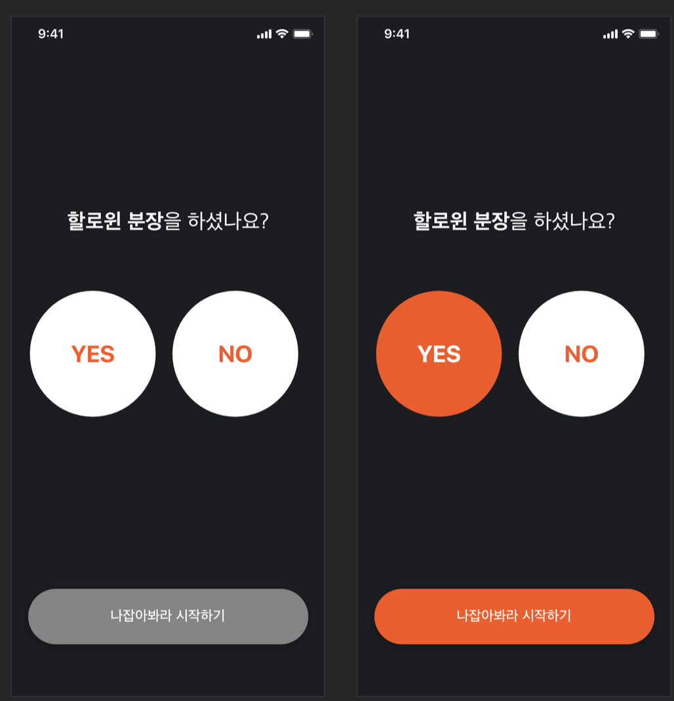
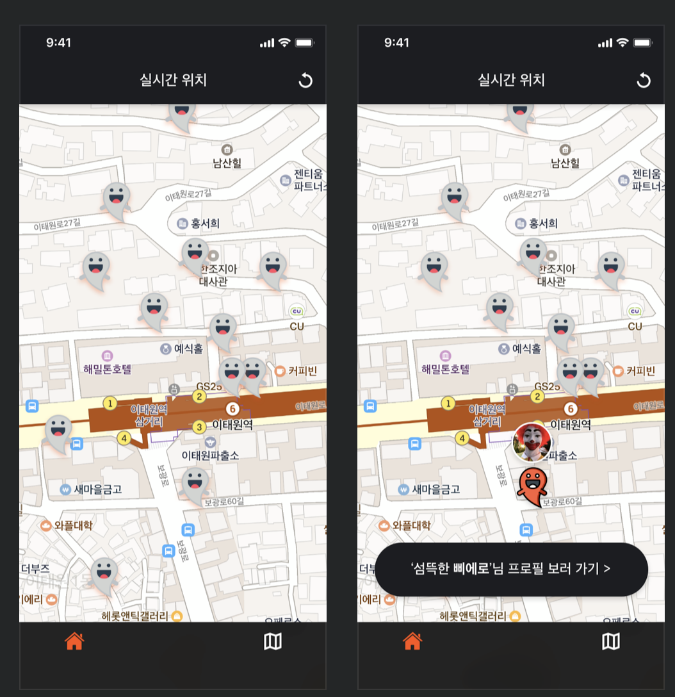
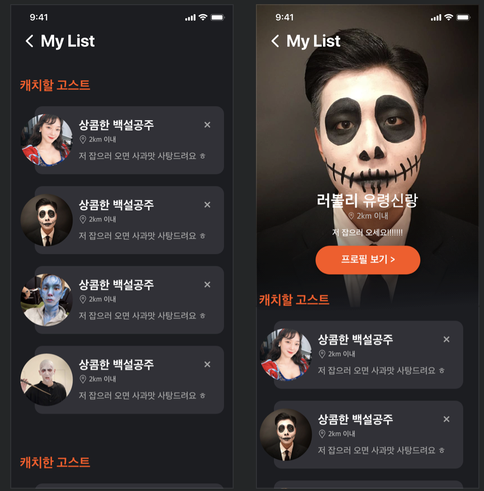
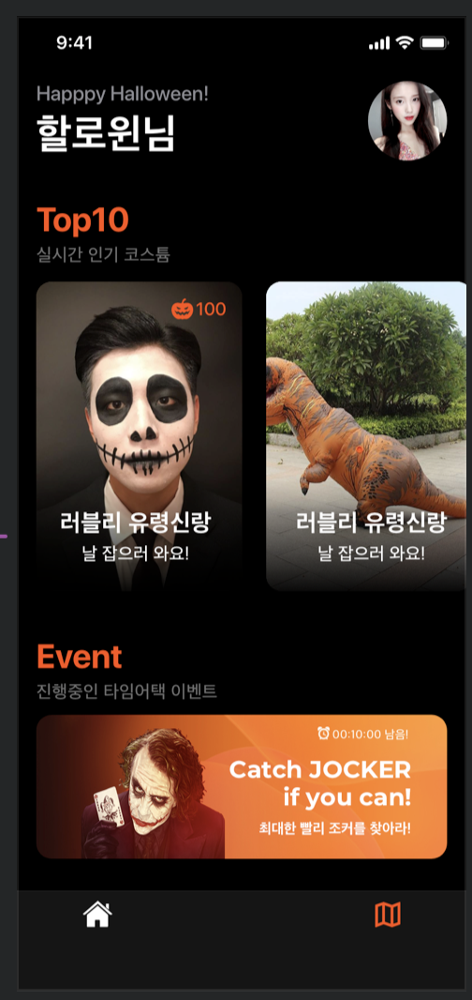
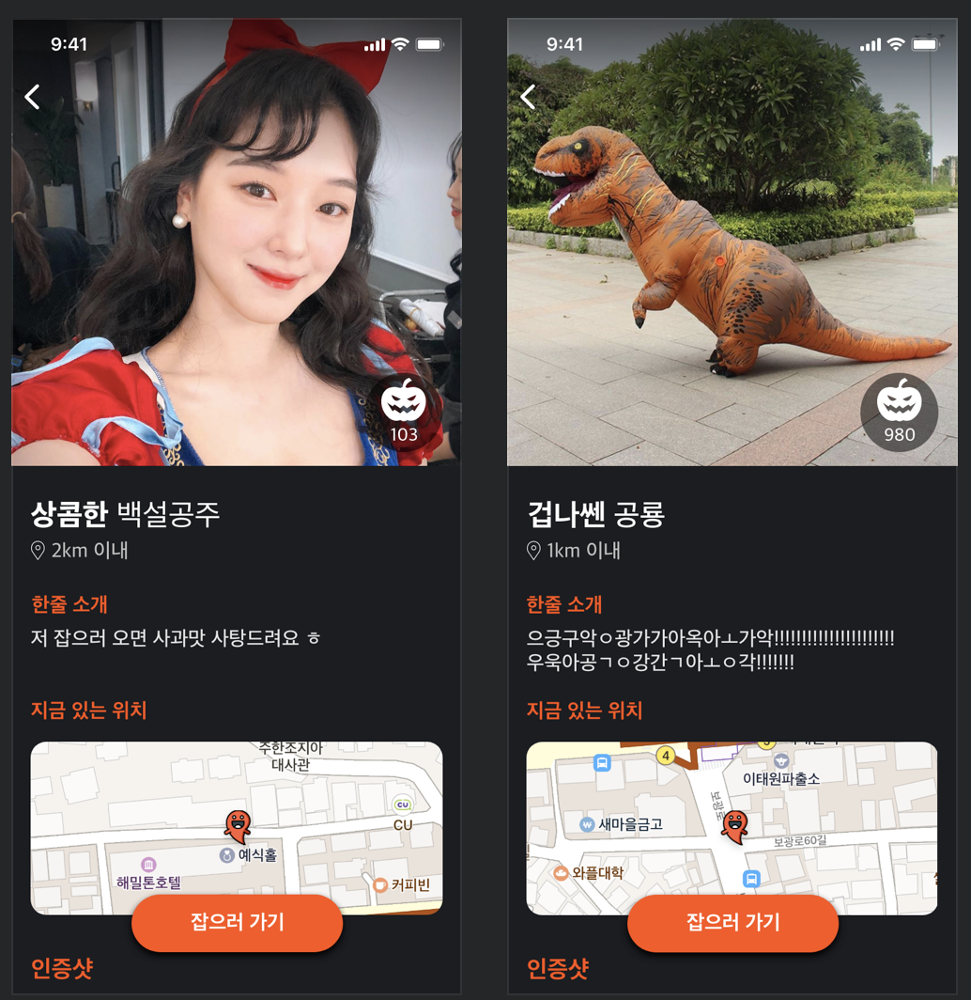

# 나잡아바라
## 솝커톤 iOS 7팀

###  일시: 2019.11.02 ~ 2019.11.03

### 주제: 할로윈

### 협업규칙
* 한글커밋
* !(강제옵셔널)금지
* guard let
* lowCamel
* 함수네이밍 - signUpButtonClick = 기능(UI이벤트)
* VC네이밍( 변수: VC, 파일명:ViewController )
* 남의 스토리보드 절대! 건들지말기
* Extension네이밍 - UIViewController+Extension.swift

## 소개

* 코스튬을 입은 사람들의 실시간 위치를 파악할 수 있는 서비스

## 기능

* 코스튬 등록한 사람중 인기랭킹 확인가능
* 지도를 통해 코스튬입은 사람의 위치 확인 가능
* 자신주변 코스튬 입은 사람들의 리스트 확인가능
* 코스튬 등록을 한 사람의 간단한 프로필 확인가능

## 사용라이브러리

* 'NMapsMap', '~> 3.2.0'
* 'Alamofire', '~> 4.8.2'
* 'SwiftyJSON', '~> 4.0'

## 앱 디자인

### 메인화면

### 지도화면

### 주변리스트

### 랭크화면

### 프로필화면

## 앱 시연

## 개발자
__iOS - [김남수](https://github.com/namsoo5)__
 
__iOS - [최은지](https://github.com/ChoiEunji0114)__
 
__iOS - [윤동민](https://github.com/dongminyoon)__

### 참여파트
* [서버파트](https://github.com/Sopkarthon/Server)